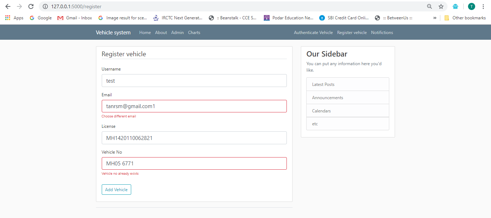
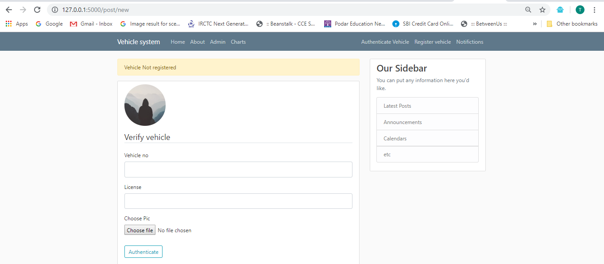
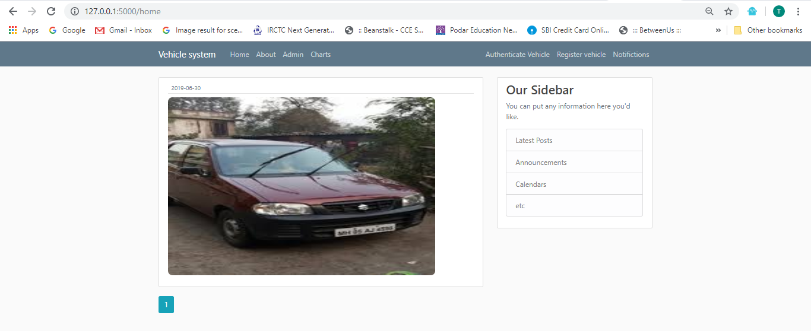
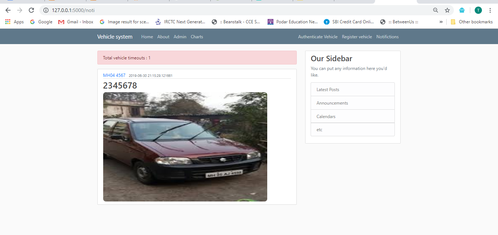
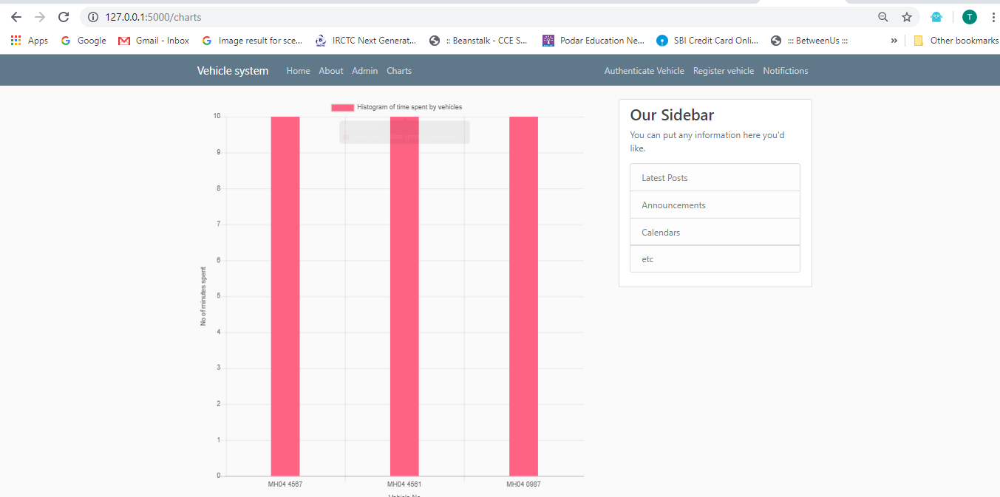

install python 3.6  
install flask ,secrets  
and then run python run.py on cmd  
The website starts on http://127.0.0.1:5000/  
  
Register new vehicle    
    
  
  
Authenticate vehicle      
  

Parked vehicle      
     

Notification       
     

Chart
     

