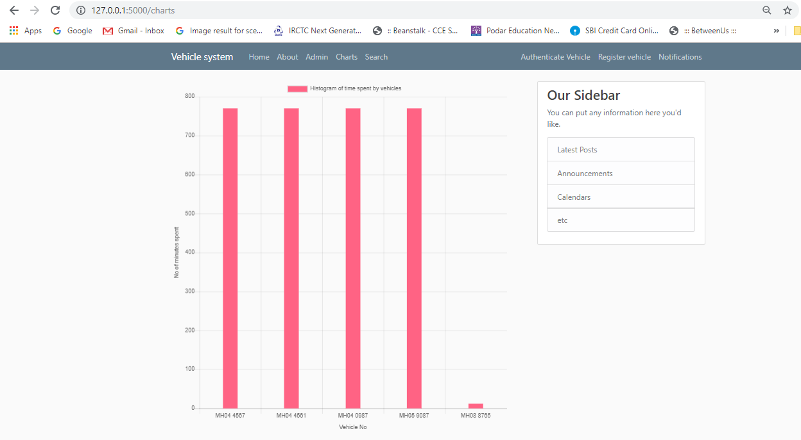
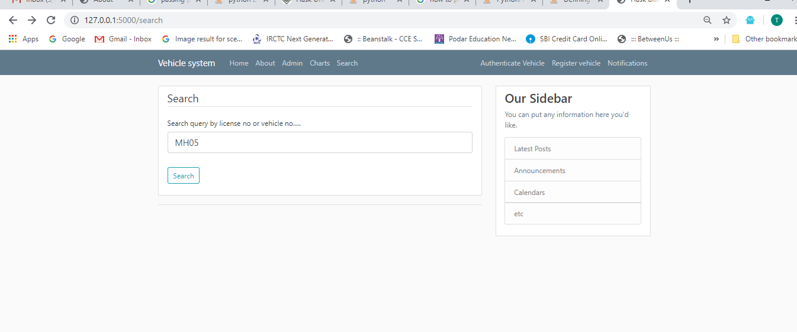
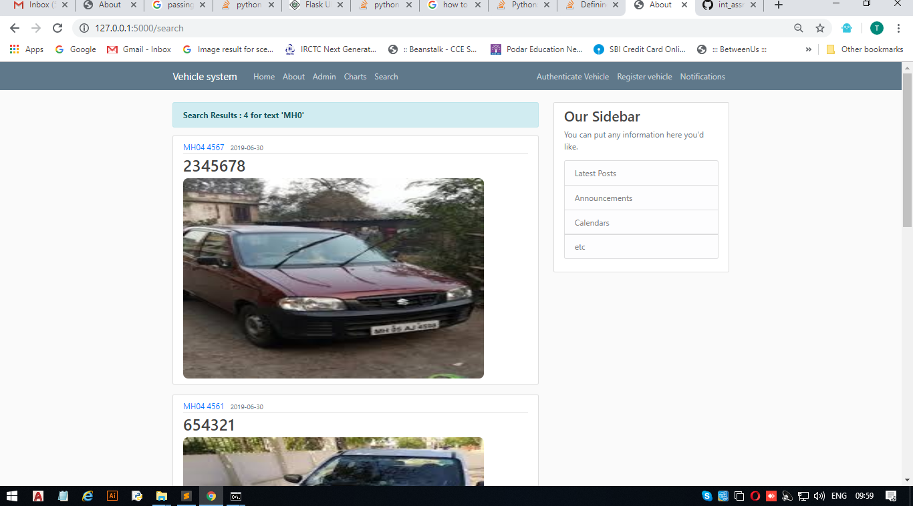

# Vehicle authentication system
## This is a system where only vehicles belonging to the apartment are registered but if any outsider arrives then he is registered and allowed to park only for limited time
## If outsider fails to report after time ,then notification is generated to admin and he can take necessary actions .
## Graphical view is also enabled for easy verification for admin

install python 3.6  
install flask ,secrets  
and then run python run.py on cmd  
The website starts on http://127.0.0.1:5000/  
    
Register new vehicle    
    
        
      
Authenticate vehicle      
      
    
Parked vehicle      
         
     
Notification       
          
     
Chart
          
       
Search query
       
       

